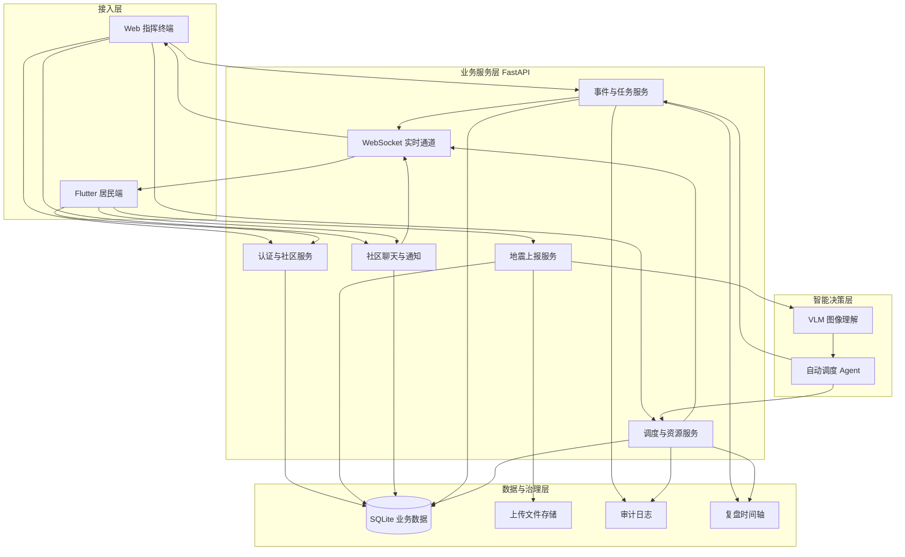
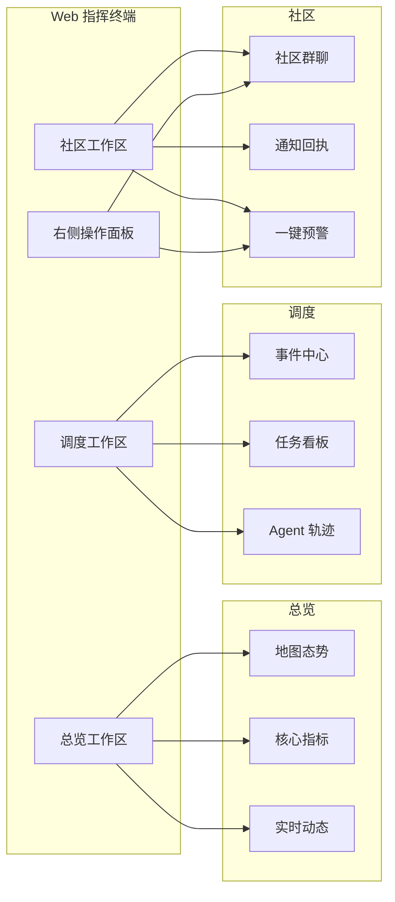
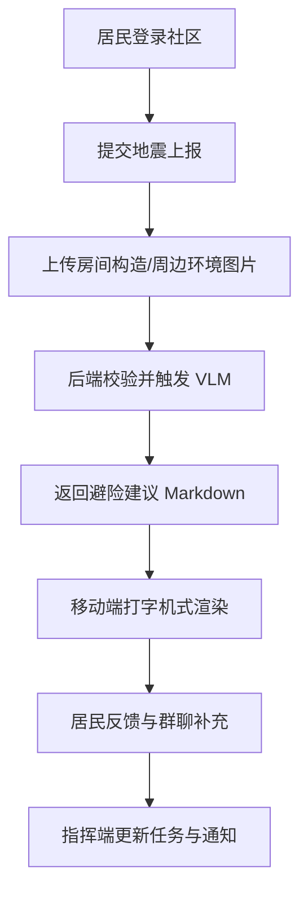
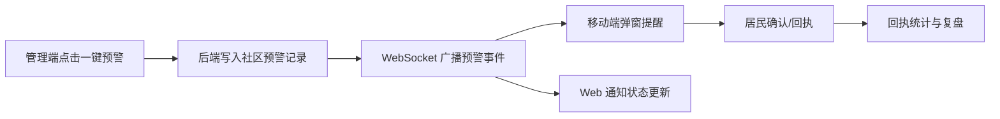
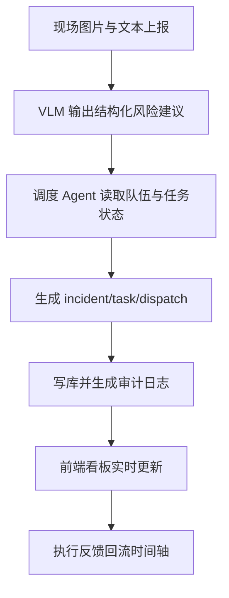

# NebulaGuard 架构与模块框架图（用于文档插图）

本文件用于《软件应用与开发类作品设计和开发文档》中的“概要设计”和“详细设计”章节配图。

建议插入位置：
- 图A：放在《概要设计》第一段后，作为总体架构图
- 图B：放在《详细设计》中“Web 指挥终端”段落后
- 图C：放在《详细设计》中“移动端上报与建议”段落后
- 图D：放在《详细设计》中“一键预警与社区触达”段落后
- 图E：放在《详细设计》中“AI 到调度闭环监管”段落后

---

## 图A 总体架构（Web + Mobile + AI + 数据）

---

## 图B Web 指挥终端模块框架

---

## 图C 移动端“上报-建议-反馈”框架

---

## 图D 一键预警与社区触达框架

---

## 图E AI 到调度闭环监管框架

