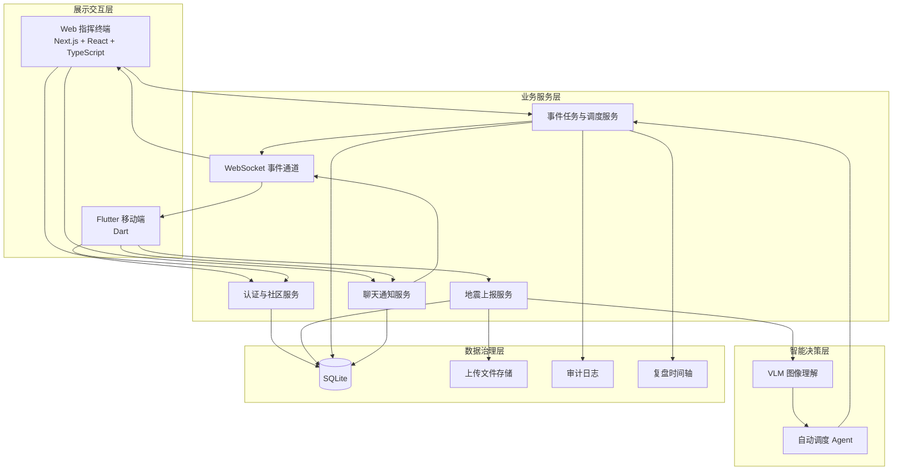
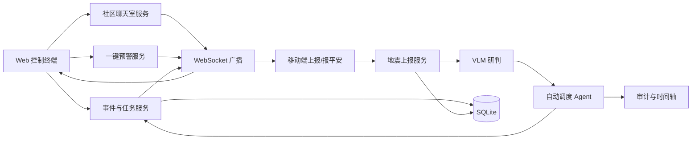

# NebulaGuard Mermaid 架构图

## 1) 总体架构图

```mermaid
flowchart TB
  subgraph UI[展示交互层]
    WEB[Web 指挥终端\nNext.js + React + TypeScript]
    APP[Flutter 移动端\nDart]
  end

  subgraph API[业务服务层]
    AUTH[认证与社区服务]
    REPORT[地震上报服务]
    OPS[事件任务与调度服务]
    MSG[聊天通知服务]
    WS[WebSocket 事件通道]
  end

  subgraph AI[智能决策层]
    VLM[VLM 图像理解]
    AGENT[自动调度 Agent]
  end

  subgraph DATA[数据治理层]
    DB[(SQLite)]
    FILE[上传文件存储]
    AUDIT[审计日志]
    TL[复盘时间轴]
  end

  WEB --> AUTH
  WEB --> OPS
  WEB --> MSG
  APP --> AUTH
  APP --> REPORT
  APP --> MSG
  REPORT --> VLM
  VLM --> AGENT
  AGENT --> OPS
  AUTH --> DB
  REPORT --> DB
  OPS --> DB
  MSG --> DB
  REPORT --> FILE
  OPS --> AUDIT
  OPS --> TL
  MSG --> WS
  OPS --> WS
  WS --> WEB
  WS --> APP
```

## 2) 模块关系图

```mermaid
flowchart LR
  WEB[Web 控制终端] --> OPS[事件与任务服务]
  WEB --> ALERT[一键预警服务]
  WEB --> CHAT[社区聊天室服务]
  APP[移动端上报/报平安] --> REPORT[地震上报服务]
  REPORT --> VLM[VLM 研判]
  VLM --> AGENT[自动调度 Agent]
  AGENT --> OPS
  CHAT --> WS[WebSocket 广播]
  ALERT --> WS
  OPS --> WS
  WS --> WEB
  WS --> APP
  OPS --> DB[(SQLite)]
  REPORT --> DB
  AGENT --> AUDIT[审计与时间轴]
```
